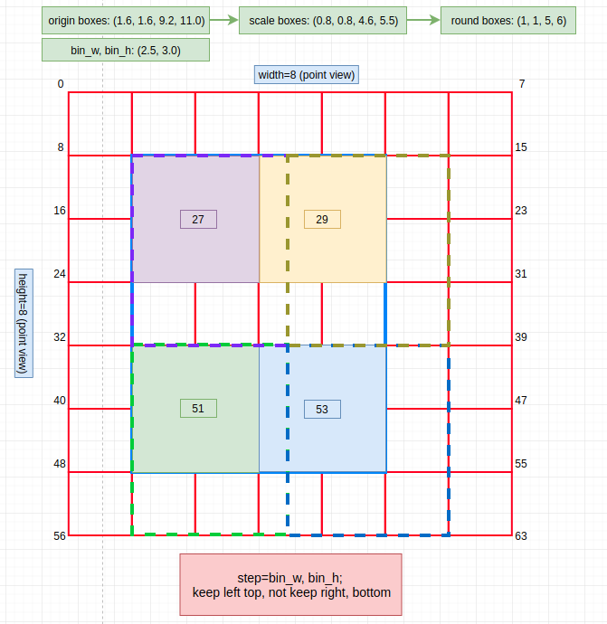
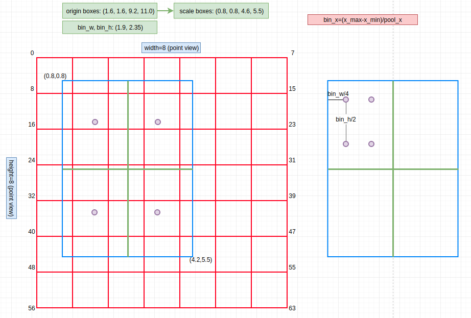

# RoI-op-pytorch
C++ extension of RoIPool & RoIAlign (both CPU and GPU) in PyTorch，this code is converted from [caffe2](https://github.com/pytorch/pytorch/tree/master/caffe2/operators) operation. （need pytorch 0.4.0）

**Note: **

1. `roi_xxx_cpu.cpp`&`roi_xxx_binding.cpp`：contains the cpu version of forward and backward operation.(Note: `roi_xxx_binding.cpp` is for pybind, you can put this code into `roi_xxx_cpu.cpp` as well) 
2. `roi_xxx_kernel.cu`&`roi_xxx_cuda.cpp`：contains the cuda version of forward and backward operation.
3. `main.py`&`temp.h`&`CMakeLists.txt`：help you to debug in c++ code, rather than to run `python setup.py install` to debug. (Note: only support cpu version ~ I don't know how to debug `.cu` code :persevere:)
4. `setup.py`：you can run `python setup.py install` to install this operation as a package (You can find this package in you python site-package)
5. `roi_xxx.py`：wrap `.cpp` code to pytorch's `Function & Module` ，there is also a small demo testing.

**Install**

```shell
cd roixxx   # roipool or roialign
python setup.py install
```

## RoI Pooling

The "strategy" of roi-pooling in this implementaion likes the follow picture:（:joy: so bad picture）



Note:  (please stand on point view rather than block view)

1. scale=0.5  
2. dotted line is the range of "seleted area" (int form in `[left, right)` and `[top, bottom)`)

## RoI Align



Note: left `sample=1`, `right sample=2`


There are several good resource to explain these two operations:

- [Region of interest pooling explained](https://blog.deepsense.ai/region-of-interest-pooling-explained/)
- [ROI Align --- chinese](http://blog.leanote.com/post/afanti.deng@gmail.com/b5f4f526490b)
- [ROI Align --- youtube](https://www.youtube.com/watch?v=XGi-Mz3do2s)

### Reference

1. [caffe2 operator](https://github.com/pytorch/pytorch/tree/a2a28c0ef1d9a433972fe72fa5b0b9b850ccfcaf/caffe2/operators)：most of the code is coming from here.
2. [extension-cpp: tutorial](https://github.com/pytorch/extension-cpp)
3. [detectorch](https://github.com/ignacio-rocco/detectorch)

